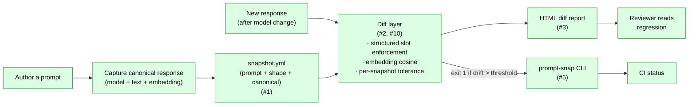

# Architecture

`prompt_regression/` is a small Python package: one snapshot schema +
one diff function + one HTML renderer + one CLI binding them
together. Six shipped feature issues map to today's surface; the
hygiene surfaces (#12, #14, #17, #19, #22) are snapshot tests that
keep the README, the demo HTML, the public surface, and the CLI
glob behavior honest as the package evolves.

```
prompt_regression/
├── schema.py        ← #1: Snapshot / Prompt / ResponseShape / CanonicalResponse
├── io.py            ← #1: YAML load/save with round-trip identity
├── diff.py          ← #2, #10: semantic similarity + structured slot-shape diff
├── html_report.py   ← #3: single-file HTML with inline SVG
├── cli.py           ← #5: prompt-snap run | update | diff
└── __init__.py      ← public surface (#19)
```

Tests in `tests/`; supporting docs and the committed worked-regression
HTML in `docs/`; the demo's regen script in `scripts/`.

## Integrated comparison flow



## Layer 1 — Snapshot schema (#1)

`Snapshot` / `Prompt` / `ResponseShape` / `CanonicalResponse`
dataclasses with strict YAML load/save semantics (D-002 — stdlib
`dataclasses` plus a manual validation pass, deliberately not
pydantic; the schema is small enough that a runtime dep buys
nothing and complicates the optional-extras story). The canonical
response embedding is stored inline in the snapshot YAML as a
list of floats (D-003 — one file is the whole snapshot, no
sidecar `.npy` blob to forget to commit). Round-trip identity
guaranteed by `tests/test_io.py`. The schema captures everything the
diff layer needs at runtime:

- **`prompt`** — model id, user/system messages, sampling params.
  Input side of the regression: if any of these change, drift is
  *expected*, not a bug.
- **`response_shape`** — what a future response must continue to
  satisfy. Split into `semantic_categories` (soft, scored by
  similarity) and `structured_slots` (hard, enforced by typed
  extraction).
- **`canonical`** — the reference response (text + inline embedding +
  embedding model name).
- **`tolerance`** — optional per-snapshot override (#10).
  Defaults to the global threshold; bumped to `1.0` for snapshots
  intentionally allowed to drift, lowered for stricter cases.

See [`docs/schema.md`](schema.md) for the field-by-field spec.

## Layer 2 — Diff (#2, #10)

`diff.py` consumes a Snapshot + a new response and returns
`{score, slot_deltas, verdict}`. Two axes, ANDed for the final
verdict (D-004 — both channels must pass; a slot mismatch fails
the verdict even when cosine looks fine, and a soft-similarity
drop fails it even when slots happen to align):

- **Structured slot diff** — typed extraction against
  `structured_slots`. A slot mismatch is *hard*: any slot diff fails
  the verdict regardless of similarity.
- **Semantic similarity** — embedding cosine between the canonical
  text and the new response. The `Embedder` is a single-method
  Protocol (D-005 — `embed(text) -> list[float]`, parallel to the
  portfolio-wide one-seam-one-method pattern). The diff refuses
  to compare when `canonical.embedding_model` doesn't match the
  current embedder's model name (D-006 — silent model mismatch
  produces meaningless cosine scores; better to fail loud with the
  two names quoted than to ship a green verdict on apples-vs-oranges
  vectors). Default global threshold 0.85; per-snapshot tolerance
  override (#10) lets you tighten or relax per case.

The diff is pure-function: no IO, no global state. Tests in
`tests/test_diff.py` and `tests/test_tolerance.py`.

## Layer 3 — HTML report (#3)

`html_report.py` renders a `DiffResult` into a single self-contained
HTML file: inline SVG sparklines, inline styles, no CDN, no JS
(D-007 — one file an operator can drop into a PR comment, email,
or static-site bucket; no asset pipeline to maintain). The
committed worked regression at `docs/regression_demo.html` (#4)
demonstrates a synthetic-but-realistic drift surfacing through the
toolchain (D-008 — responses are synthetic and the demo HTML
labels them as such; an operator swaps the two strings in
`scripts/render_regression_demo.py` for a real captured
before/after when a real model upgrade lands, no other change
required).

`tests/test_html_report.py` covers the renderer. The committed HTML
itself is locked to the renderer output by
`tests/test_regression_demo_snapshot.py` (#12) — so a future tweak to
the renderer can't silently desync the committed file from what the
script would produce.

## Layer 4 — CLI (#5)

`cli.py` is the single argparse entry point binding the schema, diff,
and renderer:

```
prompt-snap run    [SNAPSHOT]...    # run snapshots, exit non-zero on regression
prompt-snap update [SNAPSHOT]...    # re-baseline (requires --force)
prompt-snap diff   SNAPSHOT INPUT   # one-off diff against a candidate text
prompt-snap stats  DIRECTORY        # population-level summary (#47)
```

`update --force` is the accidental-rebaseline guard: `update` without
`--force` exits with a clear "did you mean to overwrite?" message.
`prompt-snap run`'s glob expansion was tightened by #22 so the
committed example snapshots are findable from any working directory;
locked by the matching test in `tests/test_cli.py`.

## Cross-cutting surfaces

- **Public surface lock (#19).** `tests/test_public_surface.py`
  pins `prompt_regression.__version__` and asserts every name in
  `__init__.py`'s `__all__` resolves.
- **README defaults snapshot (#17).**
  `tests/test_readme_defaults_snapshot.py` locks the README's quoted
  defaults / identifier claims to the source.
- **HTML demo snapshot (#12).**
  `tests/test_regression_demo_snapshot.py` locks the committed
  `docs/regression_demo.html` to the renderer output.
- **README session-framing pivot (#14).** Drove the previous round
  of README rewrites; the snapshot tests above are the lock against
  reverting.
- **CLI glob fix (#22).** Tightened `prompt-snap run`'s default
  glob so committed example snapshots are findable from any
  working directory; locked by `tests/test_cli.py`.
- **Stats (#47).** `prompt_regression.stats.collect_stats(directory)`
  walks a snapshots dir (same globs `run` uses) and returns a
  `StatsReport` with per-`prompt.model` / per-`canonical.embedding_model`
  / per-`schema_version` / per-`structured_slots`-count histograms plus
  a `ToleranceDistribution` summary (count_default + count_explicit +
  count_always_pass + min/median/max). Exposed as `prompt-snap stats`;
  locked by `tests/test_stats.py`.

## What's deliberately not in the suite

- **Replacing `llm-eval-harness`.** That repo does dataset-style
  scoring; this one does snapshot-style testing. The boundary is
  documented in the README's "What this is" section.
- **A web UI.** Per handoff §2, "CLI + CI is enough." Single-file
  HTML reports are the user surface.
- **Online embedding for the diff.** The embedding model is named in
  `canonical.embedding_model` and applied locally; the diff itself
  doesn't make network calls.

## Where to look next

- **Layer code** — `prompt_regression/<module>.py` per the directory
  diagram above.
- **Per-layer tests** — `tests/test_<layer>.py`.
- **Demo regen** — `scripts/render_regression_demo.py`,
  `docs/regression_demo.html`,
  `tests/test_render_regression_demo.py`,
  `tests/test_regression_demo_snapshot.py`.
- **Design decisions** — `MEMORY/core_decisions_human.md` for prose,
  `MEMORY/core_decisions_ai.md` for the structured log.
