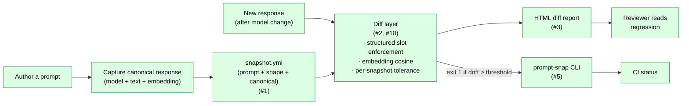

# Architecture

`prompt_regression/` is a small Python package: one snapshot schema +
one diff function + one HTML renderer + one CLI binding them
together. Six shipped feature issues map to today's surface; the
hygiene surfaces (#12, #14, #17, #19, #22) are snapshot tests that
keep the README, the demo HTML, the public surface, and the CLI
glob behavior honest as the package evolves.

```
prompt_regression/
├── schema.py        ← #1: Snapshot / Prompt / ResponseShape / CanonicalResponse
├── io.py            ← #1: YAML load/save with round-trip identity
├── diff.py          ← #2, #10: semantic similarity + structured slot-shape diff
├── html_report.py   ← #3: single-file HTML with inline SVG
├── cli.py           ← #5: prompt-snap run | update | diff
├── stats.py         ← #47: population-level directory summary (collect_stats)
├── validate.py      ← #49: collecting-mode directory lint (validate_snapshots)
└── __init__.py      ← public surface (#19)
```

Tests in `tests/`; supporting docs and the committed worked-regression
HTML in `docs/`; the demo's regen script in `scripts/`.

## Integrated comparison flow



## Layer 1 — Snapshot schema (#1)

`Snapshot` / `Prompt` / `ResponseShape` / `CanonicalResponse`
dataclasses with strict YAML load/save semantics (D-002 — stdlib
`dataclasses` plus a manual validation pass, deliberately not
pydantic; the schema is small enough that a runtime dep buys
nothing and complicates the optional-extras story). The canonical
response embedding is stored inline in the snapshot YAML as a
list of floats (D-003 — one file is the whole snapshot, no
sidecar `.npy` blob to forget to commit). Round-trip identity
guaranteed by `tests/test_io.py`. The schema captures everything the
diff layer needs at runtime:

- **`prompt`** — model id, user/system messages, sampling params.
  Input side of the regression: if any of these change, drift is
  *expected*, not a bug.
- **`response_shape`** — what a future response must continue to
  satisfy. Split into `semantic_categories` (soft, scored by
  similarity) and `structured_slots` (hard, enforced by typed
  extraction).
- **`canonical`** — the reference response (text + inline embedding +
  embedding model name).
- **`tolerance`** — optional per-snapshot override (#10).
  Defaults to the global threshold; bumped to `1.0` for snapshots
  intentionally allowed to drift, lowered for stricter cases.

See [`docs/schema.md`](schema.md) for the field-by-field spec.

## Layer 2 — Diff (#2, #10)

`diff.py` consumes a Snapshot + a new response and returns
`{score, slot_deltas, verdict}`. Two axes, ANDed for the final
verdict (D-004 — both channels must pass; a slot mismatch fails
the verdict even when cosine looks fine, and a soft-similarity
drop fails it even when slots happen to align):

- **Structured slot diff** — typed extraction against
  `structured_slots`. A slot mismatch is *hard*: any slot diff fails
  the verdict regardless of similarity.
- **Semantic similarity** — embedding cosine between the canonical
  text and the new response. The `Embedder` is a single-method
  Protocol (D-005 — `embed(text) -> list[float]`, parallel to the
  portfolio-wide one-seam-one-method pattern). The diff refuses
  to compare when `canonical.embedding_model` doesn't match the
  current embedder's model name (D-006 — silent model mismatch
  produces meaningless cosine scores; better to fail loud with the
  two names quoted than to ship a green verdict on apples-vs-oranges
  vectors). Default global threshold 0.85; per-snapshot tolerance
  override (#10) lets you tighten or relax per case.

The diff is pure-function: no IO, no global state. Tests in
`tests/test_diff.py` and `tests/test_tolerance.py`.

`DiffResult` / `SlotDelta` / `SemanticCategoryScore` each carry an
explicit `.to_dict()` (#51) with a field-by-field contract — no
`dataclasses.asdict` reliance — so a future internal-only field on
any of them can't silently leak into the `prompt-snap diff --json`
or `prompt-snap run --json` output that CI annotators and ad-hoc
scripts bind to. Same observability-parity shape shipped in
`llm-cost-optimizer`, `rag-production-kit`, `python-async-llm-pipelines`,
and `vector-search-at-scale`.

`Snapshot.to_dict()` is also explicit-field (#51): preserves the
existing None-drop tidy-up for `notes` / `tolerance` (kept absent
in YAML when unused) while pinning the eight-field surface that
committed `snapshots/*.yaml` consumers depend on. Nested sections
(`prompt`, `response_shape`, `canonical`) delegate to their own
`to_dict` so the nested shapes are pinned by the nested classes'
contracts.

## Layer 3 — HTML report (#3)

`html_report.py` renders a `DiffResult` into a single self-contained
HTML file: inline SVG sparklines, inline styles, no CDN, no JS
(D-007 — one file an operator can drop into a PR comment, email,
or static-site bucket; no asset pipeline to maintain). The
committed worked regression at `docs/regression_demo.html` (#4)
demonstrates a synthetic-but-realistic drift surfacing through the
toolchain (D-008 — responses are synthetic and the demo HTML
labels them as such; an operator swaps the two strings in
`scripts/render_regression_demo.py` for a real captured
before/after when a real model upgrade lands, no other change
required).

`tests/test_html_report.py` covers the renderer. The committed HTML
itself is locked to the renderer output by
`tests/test_regression_demo_snapshot.py` (#12) — so a future tweak to
the renderer can't silently desync the committed file from what the
script would produce.

## Layer 4 — CLI (#5)

`cli.py` is the single argparse entry point binding the schema, diff,
and renderer:

```
prompt-snap run    [SNAPSHOT]...    # run snapshots, exit non-zero on regression
prompt-snap update [SNAPSHOT]...    # re-baseline (requires --force)
prompt-snap diff   SNAPSHOT INPUT   # one-off diff against a candidate text
prompt-snap stats  DIRECTORY        # population-level summary (#47)
prompt-snap validate DIRECTORY      # collecting-mode lint (#49)
```

`update --force` is the accidental-rebaseline guard: `update` without
`--force` exits with a clear "did you mean to overwrite?" message.
`prompt-snap run`'s glob expansion was tightened by #22 so the
committed example snapshots are findable from any working directory;
locked by the matching test in `tests/test_cli.py`.

## Cross-cutting surfaces

- **Public surface lock (#19).** `tests/test_public_surface.py`
  pins `prompt_regression.__version__` and asserts every name in
  `__init__.py`'s `__all__` resolves.
- **README defaults snapshot (#17).**
  `tests/test_readme_defaults_snapshot.py` locks the README's quoted
  defaults / identifier claims to the source.
- **HTML demo snapshot (#12).**
  `tests/test_regression_demo_snapshot.py` locks the committed
  `docs/regression_demo.html` to the renderer output.
- **Every README `run` table is pinned to measured output (#169).** The
  README shows `run`'s output twice — once in the feature narrative and
  once opening the CLI-tour fence — and neither was pinned. One had
  already drifted: its header read `total=2 failed=1 skipped=0` where the
  tool prints `... unmatched=0`.

  Two prose claims each covered a smaller scope than they read as. The
  sentence "Every verdict, cosine and count in the block above is the
  tool's actual output, pinned by
  `tests/test_readme_cli_tour_examples.py`" was true only after that
  module's slice boundary, which began at `"# Ad-hoc diff"` — *after* the
  `run` demonstration opening the same fence. And
  `test_the_pass_cosine_is_the_same_number_the_run_table_reports` ran
  `diff`, never `run`, and ended with `assert "0.806" in
  README.read_text()` — the substring anywhere in a 400-line file, which
  four separate mentions satisfy. Measured: rewriting **both** run tables
  to `0.900` while leaving the `diff` examples alone left all 683 tests
  green, across exactly the edit that test's docstring said could not
  happen silently.

  `tests/test_readme_run_tables.py` closes it by **discovering** every run
  block in the README from the header signature the tool prints, rather
  than listing them — a hand list is what produced two blocks and one
  lock. It compares the header's *field set* as well as its values,
  because the original drift was a missing field and a cosine-only
  comparison would not have seen it. The tour slice now starts at the
  fence, so the sentence about it is true, and the cross-block test takes
  its number from the tour's own table instead of from the file at large.
- **README session-framing pivot (#14).** Drove the previous round
  of README rewrites; the snapshot tests above are the lock against
  reverting.
- **CLI glob fix (#22).** Tightened `prompt-snap run`'s default
  glob so committed example snapshots are findable from any
  working directory; locked by `tests/test_cli.py`.
- **Stats (#47).** `prompt_regression.stats.collect_stats(directory)`
  walks a snapshots dir (same globs `run` uses) and returns a
  `StatsReport` with per-`prompt.model` / per-`canonical.embedding_model`
  / per-`schema_version` / per-`structured_slots`-count histograms plus
  a `ToleranceDistribution` summary (count_default + count_explicit +
  count_strictest + min/median/max). Exposed as `prompt-snap stats`;
  locked by `tests/test_stats.py`.
- **Validator (#49).** `prompt_regression.validate.validate_snapshots(directory)`
  walks the same globs in *collecting* mode and surfaces every
  malformed file as a `ValidationFinding` (codes `parse |
  schema_version | schema | duplicate_id | empty`). Unlike `stats`,
  which silently skips load failures, the validator anchors the
  per-file errors `prompt-snap run` would abort on, so an operator
  can fix all of them before the next run. Exposed as `prompt-snap
  validate`; exit codes 0/1/2 (clean / findings / missing-dir); JSON
  contract via `ValidationReport.to_dict`. Pairs with `stats` (audit
  the healthy population) and `run` (consume it). Locked by
  `tests/test_validate.py`.

- **The schema-version rule is shared by both seams (#165).**
  `load_snapshot` required `str(schema_version) == SCHEMA_VERSION` and
  raised with the dedicated `code="schema_version"`; `save_snapshot`
  required nothing, because `Snapshot.__post_init__` runs
  `_require_str(self.schema_version)` and stops — the field was
  checked for being *a string* and never for being *the supported
  version*. So the canonical writer emitted files its own loader
  refuses: `'2'`, `'1.5'` and `'01'` all round-tripped out and failed
  on the way back in. `'01'` is the one worth naming, because the
  comparison is on `str(version)` deliberately (an unquoted YAML
  `schema_version: 1` parses as the int `1`, and rejecting a
  hand-authored snapshot with "is 1 … supports '1'" reads as
  nonsense) — `'01'` is a string that survives that leniency and still
  fails. `_require_supported_schema_version` is now the one
  definition, called by both, with the leniency inside it rather than
  at the caller: the comparison is the obvious half and the `str()` is
  the half someone re-deriving would omit. Locked by
  `tests/test_snapshot_version_write_path.py`, which also pins the
  representability and non-finite axes as *measured clean* so they are
  not re-hunted.

- **Stream write totality (#160, #163).** Every write this package
  makes to a standard stream goes through one of two funnels in
  `prompt_regression/io.py` — `_eprint` for stderr, `_print` for
  stdout — which share one retry, so they cannot answer differently
  for the same string. Any diagnostic or report interpolates operator
  input (a `--out` destination, a snapshots directory, a snapshot id
  read off the filesystem), and `sys.argv` / `os.listdir` decode with
  `surrogateescape`, so any of them can hold a lone surrogate with no
  UTF-8 encoding. The retry escapes through the stream's *own*
  encoding with `backslashreplace`, not `ascii()`, so an ordinary
  non-ASCII message stays readable and only the run that genuinely
  cannot be encoded degrades.

  #160 covered stderr, which CPython already gives
  `errors="backslashreplace"` — so that half only ever fired under a
  strict-handler stream like `pytest`'s `capsys`. `sys.stdout` is
  `strict` in an ordinary environment, so #163's half fires on a real
  process: in `cli._update_command` the failure path was funnelled and the
  success path printed the same `snapshot_path` bare, meaning a
  successful update wrote the file and then died announcing it.

  The lock is on a population a scan can check: no file outside
  `io.py` may write to a standard stream. It is an **AST** scan
  covering three spellings — `print(..., file=sys.stderr)`,
  `sys.stdout.write(...)`, and a bare `print(...)`. The third is the
  one that matters: stdout is `print`'s default, so the most ordinary
  way to write to it names no stream, and a rule phrased over
  `sys.stdout` misses it entirely. `tests/test_stderr_totality.py`
  holds the lock; `tests/test_stdout_totality.py` holds the stdout
  behaviour.

  **Two boundaries, both stated rather than inferable.** `argparse`
  writes its own `error: unrecognized arguments: ...` before any code
  here runs — stdlib, out of reach, pinned as
  `test_argparse_is_a_known_gap`. And `--json` is safe by
  construction, not by this fix: `json.dumps` defaults to
  `ensure_ascii=True`, so an unencodable id is written as the ASCII
  escape `\udcff` and round-trips exactly. A later switch to
  `ensure_ascii=False` would change that, and a test says so.

## Type checking (D-009)

A non-strict `mypy` gate runs over `prompt_regression` in the CI lint
job and again as `tests/test_mypy_clean.py`, both invoking a **bare**
`mypy` so they read exactly the `[tool.mypy]` block in
`pyproject.toml` — the test, the CI step and a developer's local run
therefore cannot drift to different scopes.

The rationale differs from two of the three sibling repos that already
have one. `llm-eval-harness` (D-016) and `llm-cost-optimizer` (D-014)
justify theirs by shipping a `py.typed` marker, so their annotations
are a downstream contract. This package ships no marker; the case here
is **latent green** rot, and #146 is the evidence rather than the
hypothesis — six errors sat on a green `main` until someone ran `mypy`
by hand while working an unrelated issue.

Four of those six were `Library stubs not installed for "yaml"`, which
is a *dependency* gap and not a code defect: the import is real and
resolvable, only its types were missing. `types-PyYAML` in the `dev`
extra is the honest fix, so no blanket `ignore_missing_imports` and no
per-module override are needed — either would have silenced a genuine
typo just as effectively. The other two were annotation slips in
`diff.py` (a name rebound across a branch chain, and a dict whose mixed
`type` / `tuple[type, ...]` values widened to `object` and made an
`isinstance` call uncheckable). Neither masked a defect — but a real
one was found in the same file while checking, and is tracked as #147.

Scoped to the package, matching all three siblings. `mypy
prompt_regression scripts tests` reports 17 further errors across 12
files; note that `mypy` *starts* here, unlike
`chunking-strategies-lab`, where a module-name collision stopped it
before checking anything — so widening the scope is real separate work
rather than blocked work.

## What's deliberately not in the suite

- **Replacing `llm-eval-harness`.** That repo does dataset-style
  scoring; this one does snapshot-style testing. The boundary is
  documented in the README's "What this is" section.
- **A web UI.** Per handoff §2, "CLI + CI is enough." Single-file
  HTML reports are the user surface.
- **Online embedding for the diff.** The embedding model is named in
  `canonical.embedding_model` and applied locally; the diff itself
  doesn't make network calls.

## Unmatched candidates are an input error (D-010)

`prompt-snap run` derives its exit code from `failed`, so a candidate
row whose key matched no snapshot used to be dropped silently and the
run exited 0 having verified nothing. Measured on the shipped
`examples/`, changing only the two keys:

| candidates file | summary | exit |
|---|---|---|
| correct (control) | `total=2 failed=1 skipped=0` | 1 |
| zero rows | `error: no candidate rows loaded` | 2 |
| 2 rows, neither key matches | `total=2 failed=0 skipped=2` | **0** |
| 2 rows, one key matches | `total=2 failed=0 skipped=1` | **0** |

`_load_candidates` already refused the zero-row file — a run with
nothing to check is meaningless — and the all-orphan file reaches the
same state by a quieter road. An unmatched key is now reported by name
(`unmatched=N` in the summary, `unmatched_candidates` in `--format
json`) and exits 2, the repo's code for an operator input error.

There is deliberately **no** separate `skipped == total` rule. A
partial candidates file has `skipped > 0` and zero orphans — a
legitimate workflow that stays green — and the only other route to
`skipped == total` is a zero-row file, already handled. A second rule
could only fire where this one does, while risking a false positive on
the partial run.

`--allow-unmatched-candidates` covers the one legitimate case: a single
candidates file shared across several snapshot directories. It turns
off the failure, not the report.

## The candidate key space is ids UNION relative paths (#171, D-011)

#167 (below) made the *id* namespace collision-free. `run`'s lookup reads
**two** namespaces, though — the snapshot's path relative to the snapshots
dir first, then its `Snapshot.id` — and `Snapshot.id` is validated only as
a non-empty string. So an id may be spelled exactly like another file's
relative path, one candidate row is consumed by two different snapshots,
and `FirstSeenIds` cannot see it because the two *ids* are distinct.

`a.yml` has id `refund-v1`; `b.yml` has id `"a.yml"`; one candidate keyed
`"a.yml"`:

| snapshot dir | `b.yml` verdict | cosine | exit |
|---|---|---|---|
| distinct ids (control) | `skipped` | — | 0 |
| id shadows a path, `b` differs | `fail` | **0.0** | 1 |
| id shadows a path, `b` is a copy | `pass` | **1.0** | **0** |

The same shape as #167's table, and the third row is the same harm: the
silently-clean report #150/D-010 says `run` must not produce. D-010's own
mechanism is defeated identically — `consumed.add(rel)` marks the key used,
so `unmatched_candidates` comes back empty. `validate` called that directory
`ok: True`.

So the rule is stated over the key space `run` reads, and `FirstSeenIds` is
seeded with every file's relative path.

**Which file is the shadow, and why it differs between the two cases.** For
an id/id collision, walk order decides: both claims are ids, and order is
the only tie-break there is. For an id shadowing a *path*, it must not. A
relative path is a file's identity — unique by construction, not changeable
without moving the file — while an id is operator-chosen metadata. The
id-carrier is the offender whether it sorts before or after the file whose
path it shadows; both directions occur and are symmetric.

**A file claiming a key twice is not a collision.** A snapshot whose own id
equals its own relative path claims one key, and the lookup consumes it
once. That is the over-broad neighbour, and it has an arm.

**One finding code, not two.** `duplicate_id` is broadened rather than
joined by a new code: `FINDING_CODES` is stable and JSON-routable, and
#133's precedent is that a new code exists when an operator routing on it
needs to fix a different *kind* of problem. Here the fix is the same in
both cases — rename a `Snapshot.id`. The code list is unchanged; its
documented meaning widens, and the reason string says which collision it
was.

## A duplicate snapshot id is an error in `run`, not only in `validate` (#167)

`validate` has reported `duplicate_id` since #49, and its module
docstring named the cost of the gap in its own words: *"the run path
silently key-collides on identical `Snapshot.id` across files"*. `run`
is the path CI executes and had no equivalent, while `Snapshot`'s
docstring said the id *"should be unique within a repo's snapshot
directory"* — an operator obligation with no check where it matters.

Measured end to end through the CLI, two snapshot files and **one**
candidate keyed by the shared id:

| snapshot dir | `b.yml` verdict | cosine | exit |
|---|---|---|---|
| distinct ids (control) | `skipped` | — | 0 |
| same id, different prompt | `fail` | **0.0** | 1 |
| same id, a renamed copy | `pass` | **1.0** | **0** |

The control is the crux. With **distinct** ids and a missing candidate
the second file is correctly `skipped` with "no candidate supplied";
with a **duplicate** id it is *evaluated*, so the collision converts an
honest "you did not test this" into a verdict computed against another
snapshot's candidate. The third row is the one worth the change — a
`pass` at cosine 1.0 and exit 0 for a snapshot that received no
candidate of its own. That is precisely the silently-clean report D-010
above established `run` must not produce, and the collision defeats
D-010's own mechanism, because `consumed.add(snap.id)` marks the key
*used* and the orphan detector sees nothing wrong.

The rule now lives once, in `validate.FirstSeenIds`, driven per file by
both `validate_snapshots` and the `run` loop. An accumulator rather
than a pass over the whole list, because both callers walk the
directory in sorted order and act on each file as they reach it — so
the *first-seen* file is whichever came first in that walk, and the two
sides agree on which file is the shadow by construction rather than by
two mirrored edits. A test asserts they emit the byte-identical
sentence.

No new verdict value ships. `ErrorEntry` already existed for a snapshot
that errored "before a `DiffResult` could be produced ... rather than a
synthetic `DiffResult` that would fabricate numbers", is counted in
`failed` so the run exits non-zero, and carries into the HTML artifact
so the report cannot read "all pass" (#71). Deliberately **not**
enforced in `Snapshot.__post_init__`: uniqueness is a property of the
directory, not of a snapshot, and the dataclass cannot see its
siblings.

## Where to look next

- **Layer code** — `prompt_regression/<module>.py` per the directory
  diagram above.
- **Per-layer tests** — `tests/test_<layer>.py`.
- **Demo regen** — `scripts/render_regression_demo.py`,
  `docs/regression_demo.html`,
  `tests/test_render_regression_demo.py`,
  `tests/test_regression_demo_snapshot.py`.
- **Design decisions** — `MEMORY/core_decisions_human.md` for prose,
  `MEMORY/core_decisions_ai.md` for the structured log.
