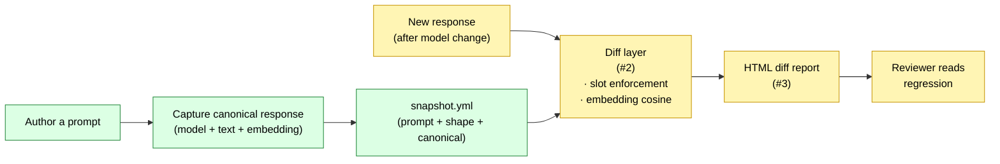

# Architecture

## Shipped (this PR — issue #1)

The snapshot YAML schema, loader/saver, and a committed sample. The
schema captures everything the diff layer needs at runtime:

- **`prompt`** — model id, user/system messages, sampling params. This
  is the input side of the regression: if any of these change, drift is
  *expected*, not a bug.
- **`response_shape`** — what a future response must continue to
  satisfy. Split into `semantic_categories` (soft, scored by similarity)
  and `structured_slots` (hard, enforced by typed extraction).
- **`canonical`** — the reference response (text + inline embedding +
  embedding model name).

See [`docs/schema.md`](schema.md) for the field-by-field spec.

## Pending

- **Diff layer (issue [#2]):** consumes a Snapshot + a new response,
  returns `{score, slot_deltas, verdict}`. Threshold default 0.85 cosine.
- **HTML report (issue [#3]):** jinja2-rendered diff that highlights
  failing slots, similarity score, and side-by-side text. Embeddable in
  CI artifacts.
- **Worked-example regression (issue [#4]):** capture a real model
  upgrade where a snapshot catches drift, screenshot the report, link
  from README.

[#2]: https://github.com/jt-mchorse/prompt-regression-suite/issues/2
[#3]: https://github.com/jt-mchorse/prompt-regression-suite/issues/3
[#4]: https://github.com/jt-mchorse/prompt-regression-suite/issues/4
